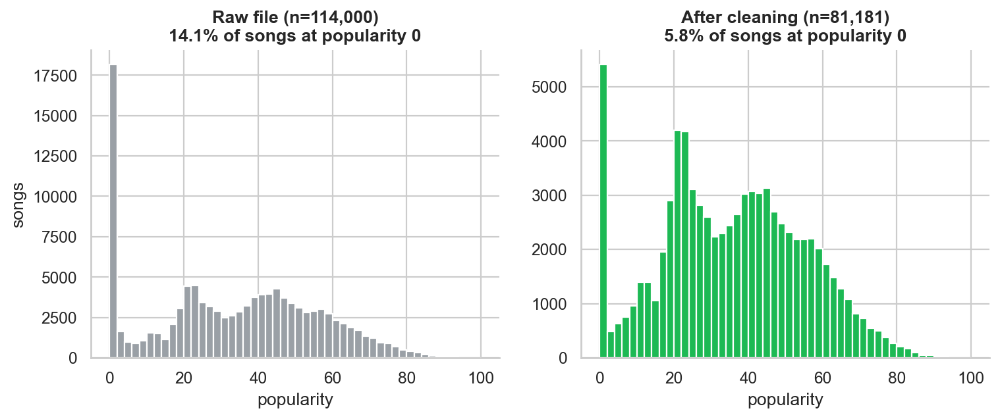
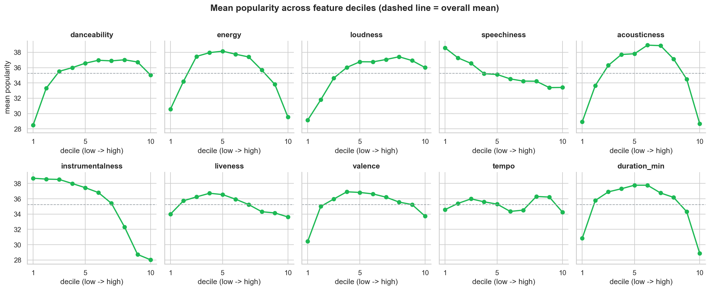
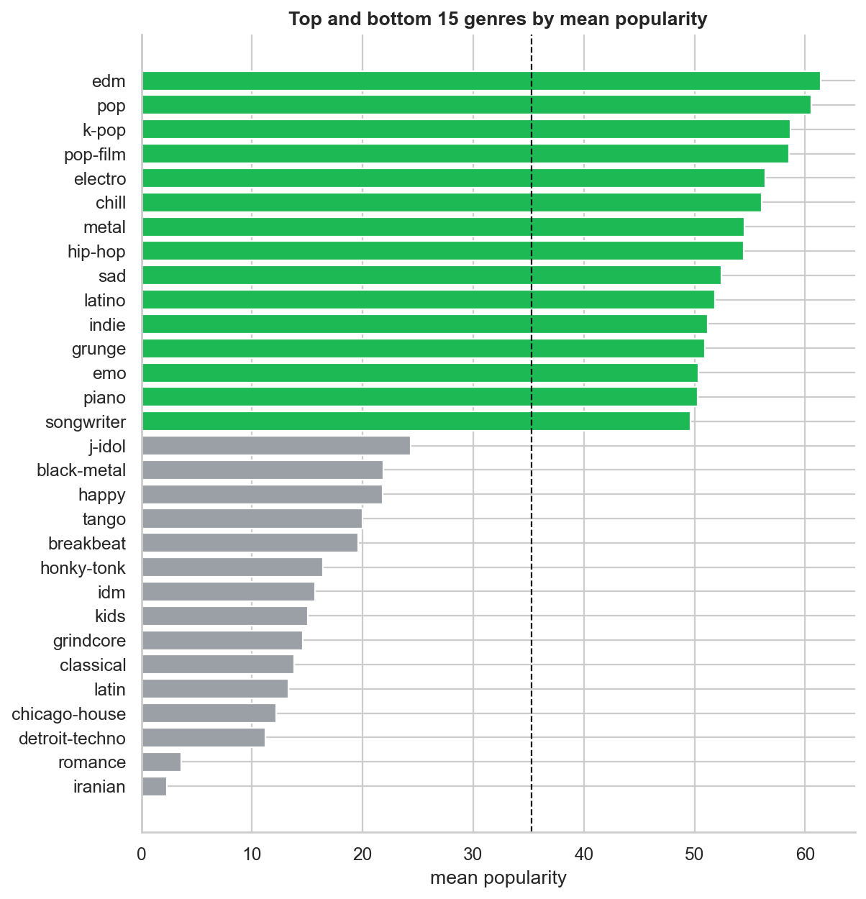
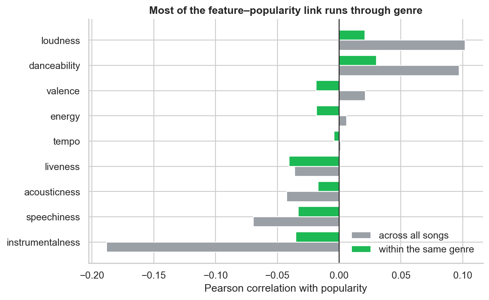
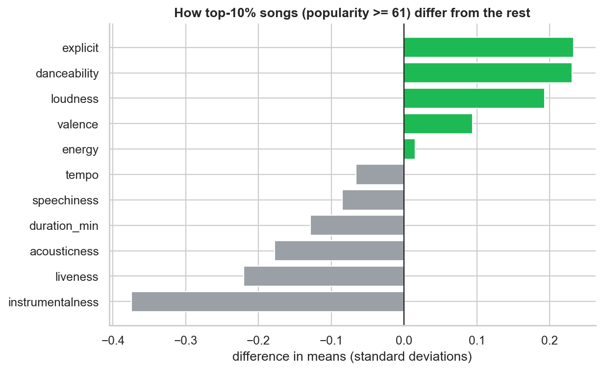
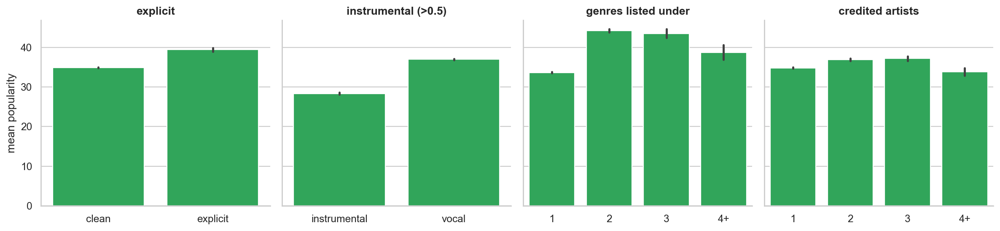

# Spotify song popularity

Can we estimate a song's Spotify popularity from its audio features, and which features matter most?
Data preparation and exploratory analysis are in notebooks 01 and 02. Modeling is in
`notebooks/03_popularity_modeling.ipynb`, starting from `data/processed/spotify_clean.csv`.

## What the data looks like

Raw file is 114,000 rows, pulled as 1,000 songs per genre. After cleaning we have 81,181 songs.
The big spike at popularity 0 is mostly duplicate releases, not songs nobody plays.



Songs at popularity 0 go from 14.1% to 5.8%. Mean popularity after cleaning is about 35, and only
about 10% of songs reach 61 or higher.

Audio features on their own barely correlate with popularity (strongest is instrumentalness, about
-0.19). The decile plot is more useful: energy, acousticness, valence and duration peak in the
middle and drop at both ends. A linear correlation averages that shape out and looks like zero.



Genre is the strong signal. Knowing the genre alone explains about 41% of the variance in
popularity. EDM, pop and k-pop sit near the top. Iranian and romance average under 4, which is
probably how those lists were filled, not a real statement about the genre.



Once you compare songs only inside the same genre, the audio correlations mostly disappear. So a
lot of "instrumental songs are less popular" is really "instrumental genres are less popular".



Top 10% songs (popularity >= 61) are more danceable, louder and more often explicit, and less
instrumental, live or acoustic. Tempo, energy and valence barely differ. Same caveat: a lot of
this is the genre mix.



Explicit songs average about 4.5 points higher, instrumental songs about 8.6 lower. Songs listed
under several genres average about 10 points higher, but `n_genres` may just reflect how the file
was collected (a popular song is easier to pull under more than one genre).



Other charts, if you want them: feature distributions
(`reports/figures/02_feature_distributions.png`) and the audio correlation heatmap
(`reports/figures/03_feature_correlation.png`). energy, loudness and acousticness move together
(|r| about 0.6-0.76).

## Layout

```
data/raw/dataset.csv                     Kaggle "Spotify Tracks Dataset", unmodified
data/processed/spotify_clean.csv         one row per unique song, with train/test split
data/processed/song_genres_long.csv      every (song_id, genre) pair, for multi-genre encoding
src/data_prep.py                         cleaning pipeline and derived features
src/plots.py                             plotting functions for the EDA notebook
notebooks/01_data_preparation.ipynb      problems in the raw file and how we fixed them
notebooks/02_exploratory_analysis.ipynb  patterns in the data and what they mean for modeling
notebooks/03_popularity_modeling.ipynb   baseline, linear regression, tree, random forest
reports/figures/                         EDA charts (PNG) for the slides
```

## Reproduce

```
pip install -r requirements.txt
jupyter notebook notebooks/01_data_preparation.ipynb      # writes data/processed/
jupyter notebook notebooks/02_exploratory_analysis.ipynb  # writes reports/figures/
```

The raw file is from [Kaggle](https://www.kaggle.com/datasets/maharshipandya/-spotify-tracks-dataset)
(also in the course Google Drive folder). We rename `track_id` -> `song_id`, `track_name` -> `song_name`
and `track_genre` -> `song_genre` to match the assignment brief.

## Cleaning steps

| step | rows left | why |
|---|---|---|
| raw file | 114,000 | |
| drop missing artist/album/name | 113,999 | one unusable row |
| drop exact duplicates | 113,549 | |
| one row per `song_id` | 89,740 | same song listed under several genres |
| one row per artist + title | 81,343 | single/album/compilation copies of the same recording, most at popularity 0 |
| drop failed audio analysis and <30 s tracks | 81,181 | tempo/time signature of 0, too short to count as a stream |

## Modeling

`notebooks/03_popularity_modeling.ipynb` fits on the train split and scores once on the test split
(80/20, grouped by primary artist, seed 42). Feature set A is the audio columns plus `n_artists`.
Set B adds `song_genre`. Cross-validation for the tree and forest is grouped by artist as well.

Test-set results:

| model | MAE | RMSE | R2 |
|---|---|---|---|
| baseline (train mean) | 16.63 | 19.85 | -0.005 |
| linear regression | 15.71 | 19.12 | 0.068 |
| decision tree | 14.96 | 18.69 | 0.110 |
| random forest, audio | 14.46 | 18.15 | 0.160 |
| random forest, audio + genre | 13.16 | 16.95 | 0.267 |

The forest with genre is the best of these. Genre is also the largest permutation importance in
that model. On audio features alone, instrumentalness, acousticness and duration rank highest.
R2 is still only about 0.27, and the model overpredicts low-popularity songs and underpredicts hits.
Charts are in the notebook.

## Editing

The repo is public, so anyone can read it. To change files, fork the repo and open a pull request.
If you are on the team and want to push straight to `main`, you need to be added as a collaborator
(Write). GitHub does not allow anonymous pushes.
